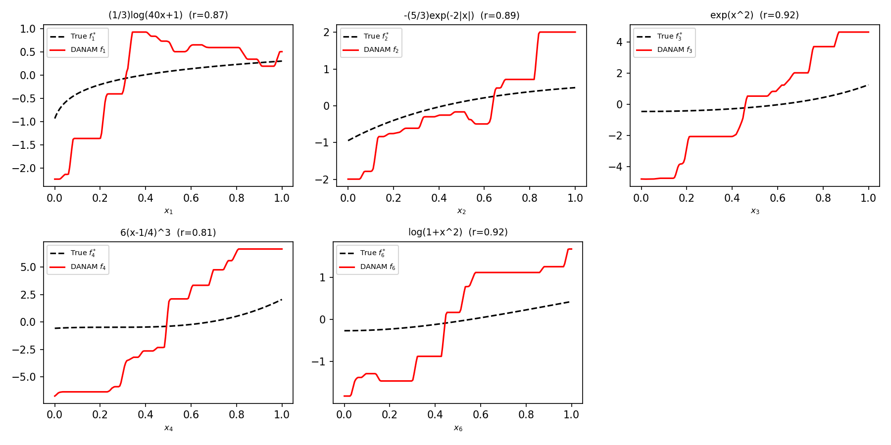

<div align="center">

# 🧠 DANAM: Distribution-Aware Neural Additive Models

**Robust Interpretable Deep Learning with Feature Selection**

[](https://github.com/zxlml/DANAM)
[](https://pytorch.org/)
[](./LICENSE)
[](https://www.python.org/)

**English** | [简体中文](README_zh.md)

</div>

> 🌟 If you find DANAM useful, please consider giving it a **star**!

## 📰 News

- **[2025-12]** 🔥 DANAM is accepted by **ICASSP 2026**.
- **[2025-12]** 🚀 PyTorch implementation released with full training pipeline, simulation suites, and shape-function recovery tools.

## 🧠 Introduction

Neural Additive Models (NAMs) offer a favorable trade-off between transparency and accuracy, but their reliance on classical loss functions makes them highly sensitive to complex noise structures — outliers, mislabeled samples, and class imbalance.

**DANAM** addresses this by rooting the learning process in **maximum likelihood estimation for adaptive error modeling**:

- 📈 **Distribution-aware loss.** The empirical error distribution is estimated on-the-fly via **kernel density estimation (KDE)**, yielding a data-adaptive objective (EDF/EML loss) without imposing restrictive distributional assumptions.
- ✂️ **Automatic feature selection.** A **group sparsity** penalty with a group soft-thresholding **proximal operator** jointly zeroes out uninformative subnetworks, yielding more interpretable models.
- 🛡️ **Inherent robustness.** DANAM stays accurate under 10% outliers, 10% label noise, and 1:10 class imbalance — conditions where conventional logistic-loss NAMs degrade substantially.
- 🔍 **Interpretability.** Each feature is modeled by a dedicated subnetwork whose learned shape function can be directly visualized and compared against the ground truth.

## ✨ Highlights

- **EDF loss** (Eq. 8 of the paper): density estimation of the probabilistic prediction error $\hat{h}\big(1-\sigma(y_i \sum_j f_j(x_i^j))\big)$, instantiated with the variable-bandwidth EML estimator.
- **Three-step optimization** (paper Sec. 3): mini-batch gradient → gradient descent step → group proximal operator $\theta_{j,t+1} = \big(1 - \eta_t\lambda\sqrt{k_j}/\|s_j\|_2\big)_+ s_j$.
- **Faithful simulation protocol**: $y_i = \mathrm{sign}\big(\sum_{j=1}^{6} f^*_j(x_{ij})\big)$ with the six ground-truth shape functions of Fig. 2, plus three perturbation scenarios (outliers / mislabeled / imbalanced).
- **Shape-function recovery**: per-feature learned curves vs. ground truth with Pearson correlation diagnostics (Fig. 2 style plots).

## 🚀 Quick Start

### 1️⃣ Environment

```bash
conda create -n danam python=3.10 -y
conda activate danam
cd codes/codes_DANAM
pip install -r requirements.txt
```

<details>
<summary><b>Dependencies</b></summary>

| Package | Version |
|---------|---------|
| torch | ≥ 2.0 |
| numpy | ≥ 1.24 |
| pandas | ≥ 2.0 |
| scikit-learn | ≥ 1.3 |
| matplotlib | ≥ 3.7 |

</details>

### 2️⃣ Run the Full Simulation Suite

```bash
sh run.sh
```

or run individual scenarios:

```bash
cd model

# Four simulation scenarios (DANAM) + sparsity ablation (DANAM-, lam = 0)
python DANAM_main.py --dataset Simulated --perturbation clean      --lam 1e-2 --n_repeats 10
python DANAM_main.py --dataset Simulated --perturbation outliers   --lam 1e-2 --n_repeats 10
python DANAM_main.py --dataset Simulated --perturbation mislabeled --lam 1e-2 --n_repeats 10
python DANAM_main.py --dataset Simulated --perturbation imbalanced --lam 1e-2 --n_repeats 10
python DANAM_main.py --dataset Simulated --perturbation clean      --lam 0    --n_repeats 10   # DANAM−

# Real benchmark datasets (Glioma / Telco)
python DANAM_main.py --dataset Glioma --lam 1e-2 --n_repeats 10
python DANAM_main.py --dataset Telco  --lam 1e-2 --n_repeats 10
```

<details>
<summary><b>⚙️ Key hyperparameters (paper Sec. 4.1)</b></summary>

| Argument | Default | Description |
|----------|---------|-------------|
| `--lam` | `1e-2` | Sparsity coefficient λ ∈ {1e-4, 1e-3, 1e-2, 1e-1} |
| `--bandwidth` | `0.4` | KDE bandwidth percentage u ∈ {0.4, 0.3, 0.2, 0.1} |
| `--batch_size` | `64` | Batch size b ∈ {32, 64, 128} |
| `--learning_rate` | `1e-3` | Initial learning rate (polynomial decay, power 0.5) |
| `--max_iterations` | `10000` | Maximum iteration count T = 10⁴ |
| `--warmup_iters` | `1000` | Logistic→EML loss annealing iterations |
| `--loss` | `eml` | `eml` (default) / `edf_kde` (literal Eq. 8) / `logistic` (Eq. 2 baseline) |
| `--n_repeats` | `10` | Number of experiment repetitions (paper: 20) |

</details>

## 📊 Experimental Results

Macro-F1 (↑) on the simulated data (10 repeats, 8:1:1 split). The 10% outlier / mislabeled corruptions and the 1:10 imbalance are applied to the training set only:

| Scenario | Test Macro-F1 | Test Error Rate |
|----------|:------------:|:---------------:|
| Clean | 0.9117 ± 0.0210 | 0.0880 |
| **10% outliers** | **0.9220 ± 0.0344** | 0.0775 |
| **10% mislabeled** | **0.8972 ± 0.0186** | 0.1025 |
| **1:10 imbalanced** | **0.8513 ± 0.0311** | 0.1465 |
| Clean, λ = 0 (DANAM−) | 0.9117 ± 0.0255 | 0.0880 |

**Shape-function recovery** (Fig. 2 of the paper) — learned curves closely track the six ground-truth component functions under all perturbation settings:

<p align="center">
  
</p>

## 📁 Project Structure

```
DANAM
├── codes/codes_DANAM
│   ├── model
│   │   ├── models.py          # NAM architecture (ExU units, per-feature subnetworks)
│   │   ├── graph_builder.py   # EDF / EML / logistic losses + group proximal operator
│   │   ├── DANAM_train.py     # Three-step optimization loop, class-balanced sampling
│   │   ├── data_utils.py      # Simulated-data generation (Fig. 2) + real dataset loaders
│   │   ├── DANAM_main.py      # CLI entry point, metrics aggregation, Fig. 2-style plots
│   │   └── run_all_sim.py     # Sequential runner for the full simulation suite
│   ├── dataset                # Glioma & Telco benchmark CSV files
│   ├── logs                   # Experiment summaries (results.csv) + shape plots
│   ├── requirements.txt
│   └── run.sh
```

## 📖 Citation

If this repository is helpful to your research, please cite:

```bibtex
@inproceedings{chen2026danam,
  title     = {Distribution-Aware Neural Additive Models: Robust Interpretable Deep Learning with Feature Selection},
  author    = {Chen, Jingyi and Zhang, Xuelin and Yuan, Peipei and Liu, Liyuan and Chen, Hong},
  booktitle = {Proceedings of the IEEE International Conference on Acoustics, Speech and Signal Processing (ICASSP)},
  year      = {2026}
}
```

## 🙏 Acknowledgements

This project builds upon [NAM](https://arxiv.org/abs/2204.01513) (Neural Additive Models) and the EDF-based empirical risk minimization framework of Chen et al., *Expert Systems with Applications*, 2024. We thank the authors of [Sparse NAM](https://link.springer.com/chapter/10.1007/978-3-031-26409-2_32) for the group-sparsity formulation.

## License

This project is released under the [Apache License 2.0](./LICENSE).
